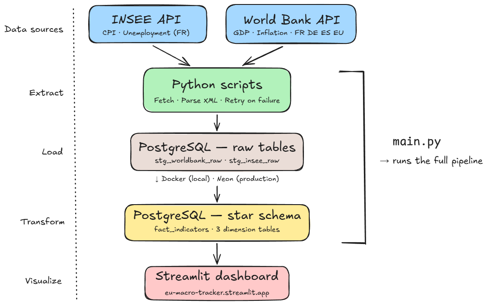
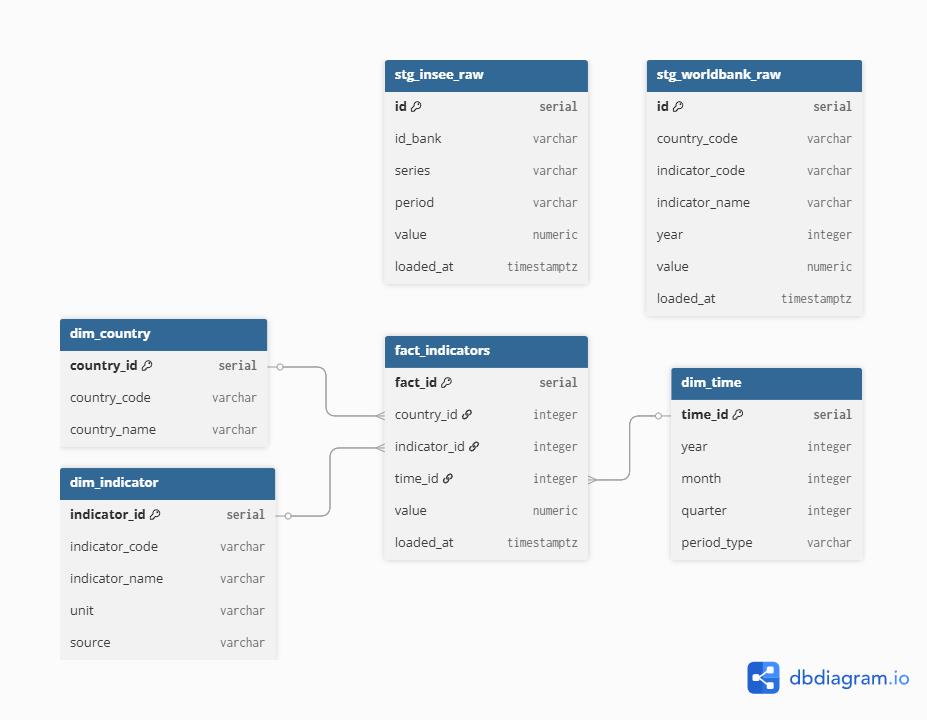

# EU Macro Tracker

> ELT pipeline and interactive dashboard tracking macroeconomic indicators across France, Germany, Spain, and the EU (2015–2025).

**🔗 [Live Dashboard](https://eu-macro-tracker.streamlit.app)** · Python · PostgreSQL · Docker · Streamlit

---

## Business question

*How have inflation, unemployment, and GDP evolved in France compared to its European neighbors since the 2022 crisis?*

**Context:** The 2022 energy crisis triggered asymmetric shocks across Europe. Understanding how each country absorbed inflation, maintained employment, and sustained growth matters for economic policy and investment decisions.

**Key findings:**
- 🔴 **Inflation:** Spain peaked at 8.4% in 2022 vs 5.2% for France — France absorbed the energy shock significantly better than its neighbors
- 📉 **Unemployment:** Spain's structural unemployment (>13% in 2022) is 4× Germany's (~3%) — a divergence that persists post-crisis
- 📈 **GDP:** EU aggregate grew from ~13 700 to ~19 500 billion USD (2015–2024); France consistently outperforms Spain in absolute output
- 🇫🇷 **French CPI (INSEE):** Rose ~15 points in 3 years (Jan 2021 → Dec 2024) — steepest increase since the 2015 index base

---

## Indicators

| Indicator | Source | Countries | Granularity |
|---|---|---|---|
| Inflation (CPI %) | World Bank | FR, DE, ES | Annual |
| Unemployment (%) | World Bank | FR, DE, ES, EU | Annual |
| GDP (current USD) | World Bank | FR, DE, ES, EU | Annual |
| Public debt (% GDP) | World Bank | ES only | Annual |
| CPI index (Base 2015) | INSEE BDM | France | Monthly |
| Unemployment BIT | INSEE BDM | France | Quarterly |

---

## Architecture



Python extracts raw data from APIs and loads it as-is into PostgreSQL staging tables. SQL handles all transformations into a star schema. Python never transforms data.

> **Infrastructure:** PostgreSQL runs locally via Docker. In production, the dashboard connects to a Neon serverless PostgreSQL instance (Frankfurt).

| Step | Detail |
|---|---|
| Extract | `requests`, SDMX-XML parsing, exponential backoff retry |
| Load | `psycopg2`, idempotent — `ON CONFLICT DO NOTHING` |
| Transform | Pure SQL — `TRUNCATE + INSERT INTO SELECT` |
| Validate | Post-transform row count checks on all 4 tables |
| Orchestrate | `main.py` — full pipeline in one command |

---

## Data model



Star schema — 2 staging tables · 3 dimensions · 1 fact table · 266 rows

| Table | Description |
|---|---|
| `stg_worldbank_raw` | Raw World Bank responses |
| `stg_insee_raw` | Raw INSEE XML responses |
| `dim_country` | FR, DE, ES, EU |
| `dim_indicator` | 6 indicators with source and unit |
| `dim_time` | Annual / monthly / quarterly periods |
| `fact_indicators` | Values linked to country, indicator, time |

---

## Tech stack


---

## Run locally

```bash
git clone https://github.com/Diamondra21/eu-macro-tracker
cd eu-macro-tracker
pip install -r requirements.txt
cp .env.example .env        # fill in your PostgreSQL credentials
docker compose up -d        # start PostgreSQL
python main.py              # extract → load → transform → validate
streamlit run app.py        # localhost:8501
```

---

## Data quality

- **Idempotence** — identical results on repeated runs
- **Null filtering** — missing values excluded at load time
- **Validation** — automated row count checks post-transform
- **Tests** — `pytest tests/` · 8 tests · data integrity + database state