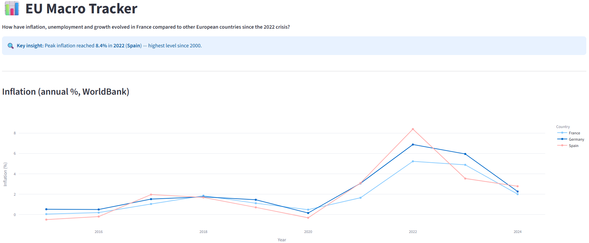

# EU Macro Tracker

> ELT pipeline + interactive dashboard to track macro indicators across France, Germany, Spain and the EU (2015–2025)

**🔗 [Live Dashboard](https://eu-macro-tracker.streamlit.app)**



Python · PostgreSQL · Docker · Streamlit

---

## Business question

How did inflation, unemployment and GDP evolve in France vs its European neighbors since the 2022 crisis?

**Context**
The 2022 energy crisis affected countries differently. The goal is to compare how each one handled inflation, employment and growth.

**Key findings**
- 🔴 **Inflation**: Spain peaked at 8.4% in 2022 vs 5.2% in France → France absorbed the shock better
- 📉 **Unemployment**: Spain >13% in 2022 vs ~3% in Germany → gap still very large post-crisis
- 📈 **GDP**: EU grew from ~13,700 to ~19,500 billion USD (2015–2024); France consistently ahead of Spain
- 🇫🇷 **French CPI (INSEE)**: +15 points in 3 years (2021–2024) → fastest rise since base 2015

---

## Indicators

| Indicator | Source | Countries | Granularity |
|---|---|---|---|
| Inflation (CPI %) | World Bank | FR, DE, ES | Annual |
| Unemployment (%) | World Bank | FR, DE, ES, EU | Annual |
| GDP (current USD) | World Bank | FR, DE, ES, EU | Annual |
| Public debt (% GDP) | World Bank | ES | Annual |
| CPI index (base 2015) | INSEE | France | Monthly |
| Unemployment (BIT) | INSEE | France | Quarterly |

---

## Architecture


Python extracts data from APIs and loads it raw into PostgreSQL staging tables. All transformations are done in SQL (star schema). Python does not modify the data.

**Infrastructure:** PostgreSQL runs locally via Docker. In production, the app connects to Neon (serverless PostgreSQL, Frankfurt).

| Step | Detail |
|---|---|
| Extract | `requests`, SDMX-XML parsing, retry with backoff |
| Load | `psycopg2`, idempotent (`ON CONFLICT DO NOTHING`) |
| Transform | SQL only (`TRUNCATE + INSERT INTO SELECT`) |
| Validate | Row count checks on all tables |
| Orchestrate | `main.py` runs the full pipeline |

---

## Data model


Star schema — 2 staging tables · 3 dimensions · 1 fact table · 266 rows

| Table | Description |
|---|---|
| `stg_worldbank_raw` | Raw World Bank data |
| `stg_insee_raw` | Raw INSEE XML |
| `dim_country` | FR, DE, ES, EU |
| `dim_indicator` | 6 indicators with source and unit |
| `dim_time` | Annual, monthly, quarterly |
| `fact_indicators` | Values linked to country, indicator and time |

---

## Tech stack


---

## Run locally

```bash
git clone https://github.com/Diamondra21/eu-macro-tracker
cd eu-macro-tracker
pip install -r requirements.txt
cp .env.example .env
docker compose up -d
python main.py
streamlit run app.py
```

---

## Data quality

- Idempotent runs — same result every time
- Null values filtered at load
- Row count checks after transform
- 8 pytest tests — data integrity and database state